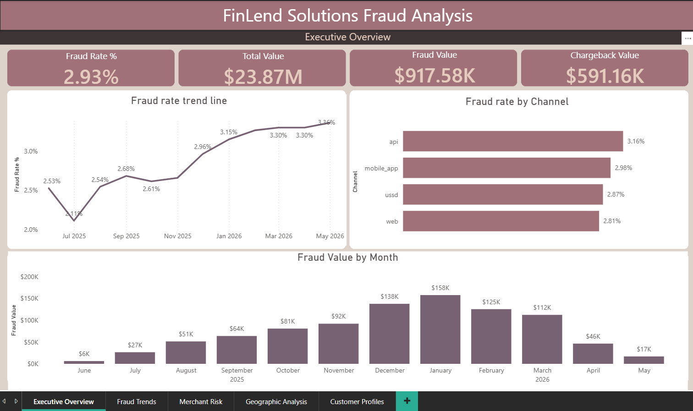
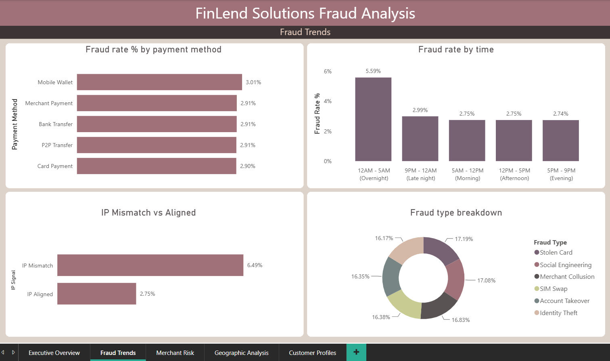
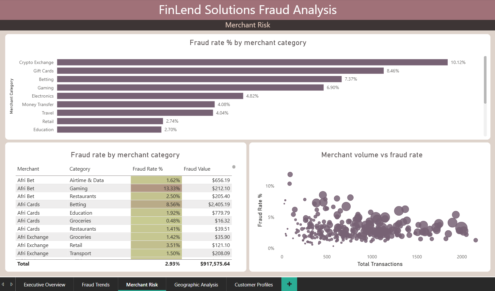
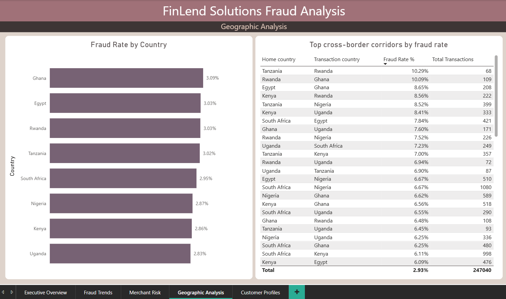
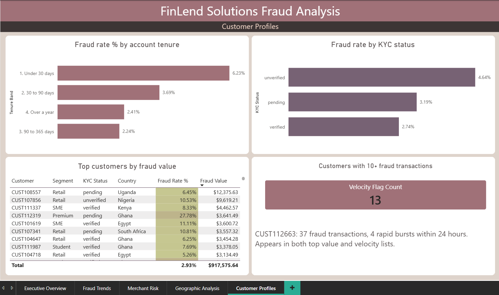
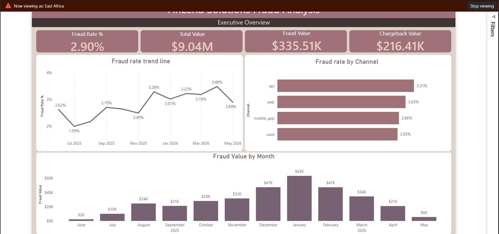

# FinLend Solutions Fraud Analysis

Identifying where fraud is happening, who is most affected, what signals it before it completes, and what the business should do about it — using SQL Server, Power BI, and a synthetic 250,000-row transaction dataset designed to model real fintech fraud patterns.

**Author:** Abijah Kabiro | Data Analyst | Nairobi, Kenya
**Tools:** SQL Server · SSMS · Power BI · DAX · Power Query · Python (dataset generation)
**Dataset:** Synthetic, AI-assisted. 250,000 transactions across 8 African markets. Built with deliberate fraud patterns and realistic data quality issues.
**Project Type:** Fraud Analytics · Data Quality · Business Intelligence · Operational Risk


---

## Business Context

FinLend Solutions is a fast-growing digital payments fintech operating across eight African markets: Kenya, Nigeria, Ghana, South Africa, Egypt, Tanzania, Uganda, and Rwanda. The platform moves money three ways. Peer-to-peer transfers between individuals. Merchant payments to businesses. Mobile wallet top-ups and withdrawals.

Transaction volume has grown fast over the past year. So has fraud. Fraud-related losses climbed approximately 40% across the year. But the company cannot clearly see the cause. The losses are visible. The patterns behind them are not.

The goal of this project was not to build a fraud-blocking system. It was to build visibility. To make fraud patterns visible so the business can target controls where they matter most, rather than applying blanket rules that hurt the customer experience everywhere.

Full honesty upfront: FinLend is fictional. The dataset is synthetic, built with AI, and fraud patterns were designed into it deliberately. Real fraud data sits behind privacy walls, so this is how I practise the actual analytical work without compromising anyone's data.

---

## Business Questions

The analysis was structured around four groups of questions, each tied to one of FinLend's blind spots:

**Group 1: Where is fraud happening?**
- Which payment methods carry the highest fraud rate?
- Which merchant categories are most affected?
- Which countries and cross-border corridors are most vulnerable?
- What times of day cluster fraud?

**Group 2: Who is most affected?**
- Which merchants carry the most risk?
- Which customers drive the most fraud value?
- Does customer tenure change fraud risk?
- Does KYC status change fraud risk?

**Group 3: What signals fraud before it completes?**
- Does a device or IP country mismatch raise fraud risk?
- Do brand new accounts behave differently from established ones?
- Are there velocity bursts that flag fraud rings?

**Group 4: How big is the problem and is it growing?**
- What is the overall fraud rate and total loss value?
- Is fraud rising across the year?
- What share of fraud value comes from the riskiest segments?

---

## Project Approach

**Phase 1: Database Setup and Staging**

Created the FinLend database in SQL Server. Built four staging tables with all NVARCHAR columns to accept dirty data without crashing. Loaded the four CSVs using BULK INSERT. Verified row counts: 250,000 transactions, 15,000 customers, 1,500 merchants, 8 countries.

**Phase 2: Data Profiling**

Measured every data quality issue before touching a single value. Ran six named checks:

| Check | Found |
|---|---|
| Null values | 10,005 missing device / 7,507 missing IP / 2,505 missing currency |
| Country labels | Up to 3 spellings per country (case, abbreviation, whitespace) |
| Bad amounts | 405 zero or negative |
| Future dates | 60 rows, all stamped 23:59:59 (system bug fingerprint) |
| Duplicates | 5,000 rows in duplicate groups (2,500 pairs) |
| Placeholder emails | 90 across 5 junk values |

Profiling before cleaning is the step most people skip. It is the step that lets you say in an interview "my data had these specific issues and here is the proof."

**Phase 3: Data Cleaning**

Built clean typed tables and moved data across from staging. Cleaned dimensions first, fact table last. The fact table cleaning resolved all six issues in a single CTE: type conversion with TRY_CONVERT, country label standardization with CASE, payment method normalization, NULL handling with NULLIF, and deduplication with ROW_NUMBER. Post-clean validation confirmed 247,040 clean rows, 8 distinct countries, 5 payment methods, 0 remaining duplicates, and 0 orphaned foreign keys.

Placeholder emails were flagged with an is_valid_email column rather than deleted. A customer with a fake email still made real transactions. Deleting the customer orphans their transaction history and breaks every join downstream. Keep the record, mark the problem.

**Phase 4: Analysis**

Answered every business question with SQL. Techniques used: multi-table JOINs, CTEs, window functions, CASE statements, RANK/DENSE_RANK/ROW_NUMBER, running totals, rolling averages, time-series aggregation with DATEPART and DATEFROMPARTS, customer tenure calculation with DATEDIFF, fraud rate calculation, composite merchant risk scoring with PERCENT_RANK, geographic aggregation, and velocity detection with LAG.

**Phase 5: Optimization**

Measured baseline query cost (4,368 logical reads), then added a clustered index and four nonclustered indexes including a covering index on transaction_timestamp. Re-measured: 658 logical reads, an 85% reduction. Also demonstrated a correlated subquery rewrite as a window function, replacing 247,040 sub-executions with a single pass.

**Phase 6: Power BI Dashboard**

Built a 5-page dashboard with a star schema data model, regional row-level security, and DAX measures for all KPIs. Each page answers one question group and ends in an action, not just a chart.

---

## Key Findings

**1. Fraud rate rose 39% across the year**

From 2.39% in the first quarter to 3.32% in the last. This is the headline number. Total fraud value across the year: $917,576 on $23.87M in transactions. The problem is real, it is growing, and it is costing money.

**2. Four merchant categories drive most of the risk**

Crypto Exchange runs at 10.12% fraud rate. Gift Cards at 8.46%. Betting at 7.37%. Gaming at 6.90%. The platform average is 2.93%. These four categories share something in common: they convert to untraceable value instantly. Fraudsters target them specifically because stolen money is hard to recover once the transaction completes. Groceries (1.44%) and Utilities (1.21%) are the safe core of the platform.

**3. New accounts are nearly three times riskier**

Accounts under 30 days old run a 6.23% fraud rate compared to 2.24% for accounts between 90 days and a year. The drop from under 30 days to 30-90 days is dramatic, almost halving from 6.23% to 3.69%. After 90 days the rate stabilises. This is the clearest argument for enforcing KYC completion and lower limits during the first month.

**4. IP country mismatch is the strongest single signal**

When the IP country diverges from the transaction country, fraud rate more than doubles to 6.49% versus 2.75% for aligned transactions. This is the impossible travel signal. A real customer in Kenya transacting in Kenya has a Kenyan IP. When the IP says Egypt and the transaction says Kenya, something is wrong.

**5. Overnight hours carry double the fraud rate**

Transactions between 12AM and 5AM run at 5.59% fraud rate. Daytime hours sit between 2.74% and 2.99%. Real customers sleep. Fraudsters and automated systems do not.

**6. The geographic story is corridors, not countries**

Country-level fraud rates are nearly flat, ranging from 2.83% (Uganda) to 3.09% (Ghana). There is no single country that is dramatically riskier. The real geographic signal is in cross-border corridors: Tanzania to Rwanda at 10.29%, Rwanda to Ghana at 10.09%, Egypt to Ghana at 8.65%. When a customer transacts outside their home country, the risk profile changes entirely.

**7. One customer stands out across multiple risk dimensions**

CUST112663: 82 total transactions, 37 confirmed fraud, 45.12% personal fraud rate, 4 rapid bursts within 24 hours. This customer appears in both the top fraud value list and the velocity detection list. That convergence across two independent queries is the strongest case for immediate account action.

---

## Data Model

Star schema. One fact table in the center, four dimension tables around it.

| Table | Role | Rows |
|---|---|---|
| fact_transactions | Records events | 247,040 (after cleaning) |
| dim_customers | Describes people | 15,000 |
| dim_merchants | Describes businesses | 1,500 |
| dim_geography | Describes places | 8 |
| dim_date | Calendar table | 366 |

Relationships: all one-to-many, single direction, from dimension to fact. No bidirectional filtering.

Transaction amounts are stored as USD equivalent. The local_currency column records the native currency for context, not the denomination of the amount field. This is standard practice in multi-currency fintech platforms to enable cross-market comparison.

---

## Dashboard Preview

### Page 1: Executive Overview

KPIs showing fraud rate (2.93%), total value ($23.87M), fraud value ($917.58K), and chargeback value ($591.16K). Includes a fraud rate trend line showing the 39% rise across the year, fraud rate by channel, and fraud value by month.



---

### Page 2: Fraud Trends

Fraud rate by payment method, fraud rate by time band (overnight at 5.59%), IP mismatch vs aligned (6.49% vs 2.75%), and fraud type breakdown showing even distribution across all six types.



---

### Page 3: Merchant Risk

Fraud rate by merchant category with Crypto Exchange at 10.12% leading. Top merchants table with conditional formatting on fraud rate and a scatter plot showing merchant volume vs fraud rate.



---

### Page 4: Geographic Analysis

Fraud rate by country (nearly flat at 2.83% to 3.09%) alongside the cross-border corridor table showing Tanzania-Rwanda at 10.29% leading. The story is corridors, not countries.



---

### Page 5: Customer Profiles

Fraud rate by account tenure (under 30 days at 6.23%), fraud rate by KYC status (unverified at 4.64%), top customers by fraud value, and velocity detection flagging 13 customers with 10+ fraud transactions.



---

## Optimization Results

| Metric | Before indexes | After indexes | Change |
|---|---|---|---|
| Logical reads | 4,368 | 658 | 85% reduction |
| CPU time | 172ms | 94ms | 45% faster |
| Elapsed time | 213ms | 116ms | 46% faster |

Additionally demonstrated a correlated subquery rewrite as a window function, replacing 247,040 individual sub-executions with a single pass over the data.

---

## Row-Level Security

Four regional roles configured: East Africa, West Africa, Southern Africa, North Africa. Each role filters dim_geography by region, and because the relationship flows from dimension to fact, every visual on every page automatically filters to that region's data only.

When viewing as East Africa, total value drops from $23.87M to $9.04M and the dashboard shows only Kenya, Tanzania, Uganda, and Rwanda transactions.


---

## Business Recommendations

**1. Tighten controls on high-risk merchant categories immediately**

Crypto Exchange (10.12%), Gift Cards (8.46%), Betting (7.37%), and Gaming (6.90%) run three to eight times the platform average. Apply stricter transaction limits, enhanced monitoring, and tighter merchant onboarding requirements for these four categories before expanding controls elsewhere.

**2. Enforce KYC completion and lower limits during the first 30 days**

New accounts carry a 6.23% fraud rate, nearly three times the platform average. This is the single clearest customer-level risk factor. Enforcing KYC verification before raising transaction limits would cut exposure during the most vulnerable period.

**3. Add step-up verification for IP mismatch and overnight transactions**

IP mismatch (6.49%) and overnight hours (5.59%) are the two strongest behavioural signals. A step-up verification rule that triggers when either condition is present would target the riskiest transactions without inconveniencing the majority of legitimate users.

**4. Apply corridor-specific velocity rules for cross-border transactions**

The geographic risk is in corridors, not countries. Tanzania-Rwanda, Rwanda-Ghana, and Egypt-Ghana all exceed 8% fraud rate. Tighter velocity rules on these specific routes, rather than blanket country restrictions, would be the most effective geographic control.

**5. Investigate CUST112663 and similar velocity-burst accounts immediately**

One customer with 37 fraud transactions and 4 rapid bursts within 24 hours represents an active account takeover or compromised identity. Any customer matching three or more high-risk signals (high personal fraud rate, velocity bursts, cross-border activity, unverified KYC) should be flagged for immediate review.

---

## Data Quality Story

Real data is dirty. This project profiled, measured, and cleaned six specific issues:

| Issue | Volume | Cause | Fix |
|---|---|---|---|
| Exact duplicate rows | 2,500 pairs | Payment retry double-posting | ROW_NUMBER dedup on 5 business fields |
| Inconsistent country labels | Thousands | Multiple source feeds | CASE standardization to canonical names |
| Casing/whitespace in payment method | Thousands | Manual and legacy entry | LTRIM, RTRIM, LOWER before CASE mapping |
| Zero and negative amounts | 405 | System glitches | Filtered out (amount must be > 0) |
| Future-dated timestamps | 60 | Clock/timezone bug | Filtered out (must be within data window) |
| Placeholder emails | 90 | Test accounts left in production | Flagged with is_valid_email, not deleted |

Every cleaning decision was documented with a before count and an after validation. The post-clean check confirmed 247,040 rows, 8 countries, 5 payment methods, 0 duplicates, and 0 orphaned foreign keys.

---

## SQL Techniques Demonstrated

| Technique | Where used |
|---|---|
| Multi-table JOINs | Every analytical query connecting fact to dimensions |
| CTEs (Common Table Expressions) | Monthly trend, merchant risk score, quarterly comparison |
| Window functions (OVER, PARTITION BY) | Running totals, rolling averages, ranking, velocity detection, deduplication |
| CASE statements | Tenure bands, country standardization, payment method normalization |
| RANK / DENSE_RANK / ROW_NUMBER / NTILE | Merchant risk ranking, category ranking, deduplication |
| Running totals | Cumulative fraud value across months |
| Rolling averages | 3-month fraud rate smoothing |
| Time-series aggregation | Monthly trend, hourly clustering with DATEPART |
| Customer tenure calculation | DATEDIFF between signup_date and transaction_timestamp |
| Fraud rate calculation | 100.0 * SUM(CAST(is_fraud AS INT)) / COUNT(*) |
| Merchant risk scoring | Composite PERCENT_RANK blending fraud rate and fraud value |
| Geographic aggregation | Country and corridor grouping with JOIN to dim_geography |
| Duplicate detection | COUNT(*) OVER (PARTITION BY business fields) |
| Data quality profiling | SUM(CASE WHEN condition THEN 1 ELSE 0 END) conditional counting |
| TRY_CONVERT | Safe type conversion that returns NULL instead of crashing |
| Covering indexes | Nonclustered index with INCLUDE columns for query optimization |

---

## Errors Encountered and Fixes

Real projects hit real problems. These were the issues encountered and how they were resolved.

| Error | Cause | Fix |
|---|---|---|
| BULK INSERT syntax error on FORMAT='CSV' | SQL Server version pre-2017 does not support FORMAT='CSV' | Removed FORMAT='CSV', used plain FIELDTERMINATOR and ROWTERMINATOR |
| BULK INSERT file not found | CSV files not in the folder the path pointed to | Moved files to the correct folder matching the BULK INSERT path |
| OneDrive access denied on BULK INSERT | SQL Server service account cannot read OneDrive cloud-only files | Right-clicked folder, chose "Always keep on this device" |
| Power BI connection error on localhost | SQL Server instance name not included | Changed server field to .\SQLEXPRESS |
| Fraud Rate % showing error in Power BI | BIT column compared to integer (= 1) instead of boolean (= TRUE) | Changed filter from is_fraud = 1 to is_fraud = TRUE in all DAX measures |
| Fraud Rate % card showing %GT prefix | Power BI applying "percent of grand total" aggregation | Used a self-contained VAR-based measure instead of referencing other measures |
| Line chart showing single dot at (Blank) | dim_date relationship not connecting to DATETIME2 with time component | Used transaction_timestamp directly with Power BI date hierarchy |
| MonthName sorting alphabetically | Text field sorts A-Z by default | Used Sort by Column in Column tools to sort MonthName by MonthNo |
| New column formula error | Used New Measure instead of New Column | Switched to New Column which operates row by row |

---

## Lessons Learned

1. Always stage data as text before typing it. One bad value in a DATETIME2 or DECIMAL column crashes the entire BULK INSERT. Text columns accept everything. Clean in the next step.

2. Profile before you clean. You cannot say "my data was dirty" in an interview unless you measured the dirt first. The profiling numbers are the evidence behind every cleaning decision.

3. In Power BI, BIT columns from SQL Server behave as TRUE/FALSE, not 1/0. Every DAX filter on a BIT column must use = TRUE instead of = 1. This caused three separate measure failures before the pattern was clear.

4. The strongest geographic signal in fraud data is often not at the country level. Country rates were nearly flat (2.83% to 3.09%). The real story was cross-border corridors running at 10%+. Always check corridor pairs before claiming a regional pattern.

5. Flag dirty records instead of deleting them. A customer with a placeholder email still made real transactions. Deleting the customer breaks every foreign key join downstream. The senior move is quieter: keep the record, mark the problem.

6. Optimization is a before-and-after story, not just an after. Capture the baseline logical reads and execution time before adding indexes. Without the before number, the improvement has no proof.

7. Synthetic data is valid for portfolio work as long as you say so plainly. Never imply production data. The analytical skills are the same. The honesty is what builds trust.

---

## Honesty Notes

**The data is synthetic.** FinLend Solutions is fictional. The dataset was generated with AI and fraud patterns were designed in deliberately. This is stated upfront because transparency matters more than the illusion of real data.

**No strong regional pattern exists.** All four regions sit between 2.83% and 3.09% fraud rate. The geographic story is cross-border corridors, not any single country or region being worse. Do not claim a regional pattern that the data does not support.

**Transaction amounts are USD equivalent.** The local_currency column records the native currency for reference, but the amount column was generated as a single normalized distribution. In a production environment, a proper currency conversion step would precede any cross-market aggregation.

---

## How to Run the Project

**SQL Server**
1. Create a database called `FinLend` in SSMS
2. Run `sql/01_create_and_load.sql` — update the four file paths to match your CSV locations
3. Run `sql/02_data_cleaning.sql` — builds clean typed tables from staging
4. Run `sql/03_analysis_queries.sql` — reproduces all findings
5. Run `sql/04_optimization.sql` — adds indexes and compares query cost

**Power BI Dashboard**
1. Download `FinLend_Fraud_Analysis.pbix` from the Power BI folder
2. Open in Power BI Desktop
3. Update the data source connection to your local SQL Server (.\SQLEXPRESS and FinLend database)
4. Navigate between pages using the tabs at the bottom
5. Test RLS by going to Modeling > View as > select a region

---

## File Structure

```
finlend/
│
├── README.md
│
├── dim_customers.csv
├── dim_geography.csv
├── dim_merchants.csv
├── fact_transactions.csv
│
├── SQL/
│   ├── FinLend.sql
│   ├── 1_csv_files_in_folder.png
│   ├── 2_staging_tables_created.png
│   ├── 3_row_count_verified.png
│   ├── 4_missing_data_profile.png
│   ├── 5_inconsistent_values.png
│   ├── 6_bad_amounts.png
│   ├── 7_future_dates.png
│   ├── 8_duplicates.png
│   ├── 9_placeholder_emails.png
│   ├── 10a_geography_cleaned.png
│   ├── 10b_customers_cleaned_flag.png
│   ├── 10b_customers_cleaned_count.png
│   ├── 10c_merchants_cleaned.png
│   ├── 10d_fact_transactions_built.png
│   ├── 11_post_clean_validation.png
│   ├── 12_executive_kpis.png
│   ├── 13_monthly_trend.png
│   ├── 14_quarterly_comparison.png
│   ├── 15_fraud_by_method.png
│   ├── 16_hourly_clustering.png
│   ├── 17_ip_mismatch.png
│   ├── 18_fraud_types.png
│   ├── 19_category_risk_ranked.png
│   ├── 20_merchant_risk_scores.png
│   ├── 21_country_fraud_rates.png
│   ├── 22_cross_border_corridors1.png
│   ├── 22_cross_border_corridors2.png
│   ├── 23_tenure_bands.png
│   ├── 24_top_risk_customers1.png
│   ├── 24_top_risk_customers2.png
│   ├── 25_velocity_rings.png
│   ├── 26_baseline_reads.png
│   ├── 27_indexes_created.png
│   ├── 28_after_optimization_reads.png
│   └── 28b_window_function_rewrite.png
│
└── PowerBI/
    ├── FinLend.pbix
    ├── Executive_Overview.png
    ├── Fraud_Trends.png
    ├── Merchant_Risk.png
    ├── Geographic_Analysis.png
    ├── Customer_Profiles.png
    ├── model_auto.png
    ├── power_bi_model.png
    ├── PowerBI_connection1.png
    ├── PowerBI_connection2.png
    ├── rls_roles.png
    ├── rls_test1.png
    └── rls_test2.png
```

---


## Further Reading

For the full project story including business context, technical walkthrough, data quality challenges, and lessons learned, read the Medium article:

[FinLend Solutions Fraud Analysis — Full Article](#) *(link to be added after publishing)*

---

## About This Project

Built by **Abijah Kabiro**, a data analyst based in Nairobi, Kenya with four years of experience in supply chain, logistics, and customer analytics. This project was built to demonstrate how SQL Server and Power BI can work together to move from dirty transactional data to actionable fraud intelligence — not just charts for visual effect.

**Connect:** [LinkedIn](https://linkedin.com/in/abijahkabiro) · [Portfolio](https://abijahkabiro.github.io) · [Medium](https://medium.com/@abijahkabiro) · [GitHub](https://github.com/Abijahkabiro)
